# Otimização de Rotas para Atendimento Especializado à Mulher

Projeto desenvolvido para o Tech Challenge da Fase 2 da pós-graduação em Inteligência Artificial da FIAP.

A aplicação implementa um sistema de otimização de rotas para distribuição de medicamentos e atendimento especializado à mulher. A solução utiliza algoritmo genético, dados sintéticos, visualização em mapa com Streamlit/Folium e integração com LLM via API do Ollama para geração de relatórios operacionais.

## Projeto escolhido

Este repositório implementa o **Projeto 2: otimização de rotas para distribuição de medicamentos e atendimento especializado à mulher**.

O sistema parte de um problema inspirado no TSP e o adapta para um cenário de roteirização com restrições, considerando:

* prioridade por tipo de atendimento;
* janelas de horário;
* capacidade máxima de suprimentos do veículo;
* geração de instruções e relatórios com LLM.

## Funcionalidades

A aplicação permite:

* carregar dados sintéticos de pontos de atendimento;
* otimizar rotas com algoritmo genético;
* configurar população, gerações, mutação e seed aleatória;
* ajustar capacidade do veículo e pesos das penalidades;
* visualizar a rota otimizada em mapa;
* identificar atendimentos por tipo com marcadores coloridos;
* acompanhar métricas, penalidades e evolução do fitness;
* visualizar a sequência operacional da rota em tabela;
* executar e comparar experimentos do algoritmo genético;
* gerar manual de instruções com LLM;
* gerar roteiro detalhado de visitas com LLM;
* responder perguntas em linguagem natural sobre a rota.

## Tipos de atendimento

O projeto considera quatro tipos de atendimento:

| Tipo                  | Prioridade |
| --------------------- | ---------: |
| Emergência obstétrica |          1 |
| Violência doméstica   |          2 |
| Medicamento hormonal  |          3 |
| Atendimento pós-parto |          4 |

Quanto menor o número, maior a prioridade.

## Tecnologias utilizadas

* Python
* Streamlit
* Folium
* Pandas
* NumPy
* Pytest
* Ollama API

## Estrutura do projeto

```text
ia-tech-challenge-2/
├── app.py
├── data/
│   ├── attendance_points.csv
│   └── distribution_center.csv
├── docs/
│   └── architecture/
├── experiments/
│   └── run_experiments.py
├── outputs/
├── src/
│   └── womens_health_route_optimizer/
│       ├── config/
│       ├── data/
│       ├── domain/
│       ├── llm/
│       ├── optimization/
│       ├── ui/
│       ├── utils/
│       └── visualization/
└── tests/
```

## Diagramas de arquitetura

Os diagramas do projeto estão disponíveis em:

```text
docs/architecture/
```

Diagramas incluídos:

* arquitetura geral do sistema;
* fluxo do algoritmo genético;
* modelo de domínio e dados;
* fluxo de integração com LLM.

### Arquitetura geral



### Fluxo do algoritmo genético



### Modelo de domínio e dados



### Fluxo da LLM



A explicação detalhada desses diagramas será apresentada no relatório técnico do projeto.

## Instalação

Crie um ambiente virtual:

```bash
python -m venv .venv
```

Ative o ambiente virtual.

No Windows:

```bash
.venv\Scripts\activate
```

No Linux/macOS:

```bash
source .venv/bin/activate
```

Instale o projeto em modo editável:

```bash
pip install -e ".[dev]"
```

## Configuração da API do Ollama

A aplicação utiliza a API do Ollama para geração dos relatórios com LLM.

Crie um arquivo `.env` na raiz do projeto ou configure a variável de ambiente:

```env
OLLAMA_API_KEY=your_ollama_api_key_here
```

Também é possível informar a API key diretamente pela sidebar da aplicação.

O arquivo `.env.example` serve apenas como referência e não deve conter chaves reais.

## Executar a aplicação

Para iniciar a interface:

```bash
streamlit run src/app.py
```

A aplicação será aberta no navegador.

Na sidebar, é possível configurar:

* tamanho da população;
* número de gerações;
* probabilidade de mutação;
* seed aleatória;
* capacidade do veículo;
* pesos das penalidades;
* URL, modelo e API key do Ollama.

## Executar os experimentos

Para gerar os resultados comparativos dos experimentos:

```bash
python experiments/run_experiments.py
```

Os resultados serão salvos em:

```text
outputs/experiments_results.csv
```

Depois disso, a aba **Experimentos** da aplicação exibirá a tabela e os gráficos comparativos.

## Executar os testes

Para rodar os testes automatizados:

```bash
pytest
```

Os testes cobrem:

* carregamento dos dados;
* cálculo de distância;
* função fitness;
* operadores genéticos;
* simulação da rota.

## [Relatório Técnico](docs/relatorio_tecnico.pdf)

A explicação completa da solução está no [relatório técnico](docs/relatorio_tecnico.pdf), que detalha:

* problema escolhido;
* modelagem dos dados sintéticos;
* adaptação do TSP para roteirização;
* representação genética;
* função fitness;
* restrições implementadas;
* integração com LLM;
* experimentos;
* resultados;
* limitações;
* considerações éticas.

## Licença

Projeto desenvolvido para fins acadêmicos.
